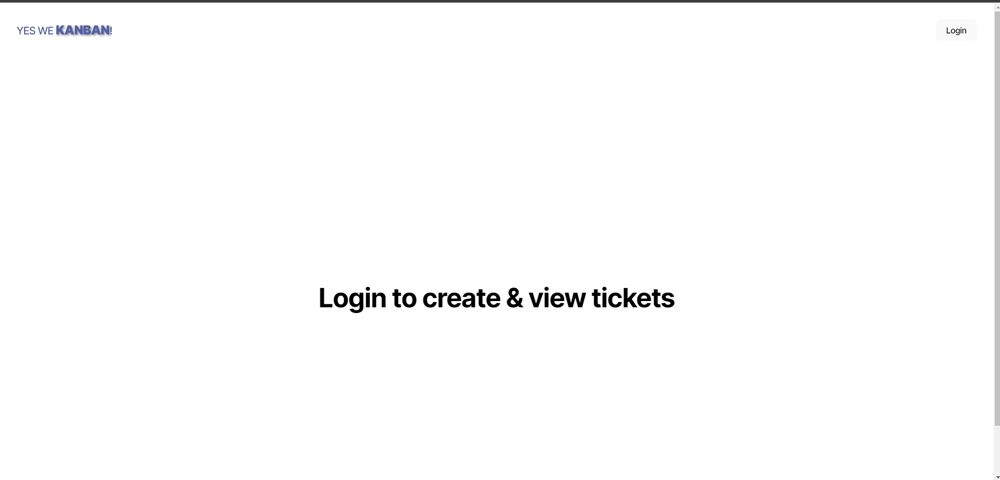
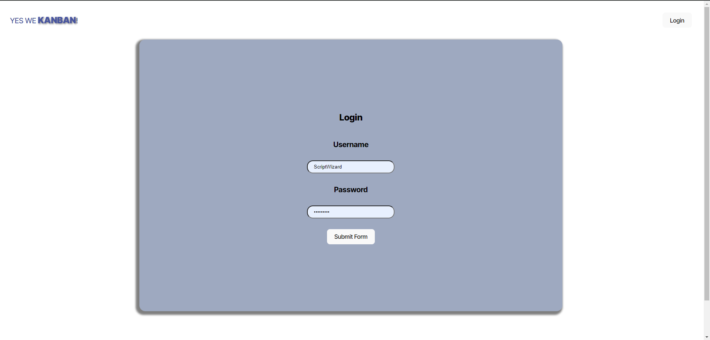
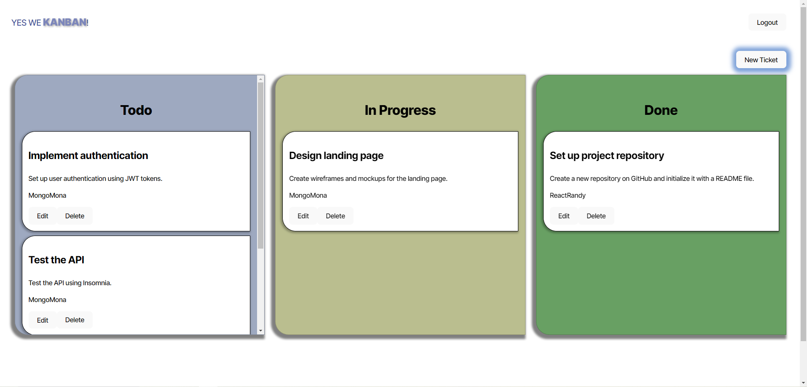

# Yes-We-Kanban


## Table of Contents

- [Yes-We-Kanban](#yes-we-kanban)
  - [Table of Contents](#table-of-contents)
  - [Description](#description)
  - [Deployment](#deployment)
  - [Installation](#installation)
  - [Usage](#usage)
  - [Features](#features)
  - [Technologies Used](#technologies-used)
  - [API Reference](#api-reference)
    - [POST /auth/login](#post-authlogin)
  - [Screenshots](#screenshots)
  - [Contributing](#contributing)
  - [License](#license)
  - [Contact](#contact)

---

## Description

**Yes-We-Kanban** is a full-stack Kanban board application designed for agile project management. It provides a visual way to track tasks across multiple statuses and ensures a secure user experience using **JWT-based authentication**. This project follows modern full-stack development practices using **React** for the frontend and **Node.js/Express** for the backend, with **PostgreSQL** as the database. The app is deployed using **Render** for easy accessibility.

---

## Deployment

The application is deployed on **Render**.

See the project in action here (may take up to 60 seconds to start up servers): [RENDER DEPLOY](https://yes-we-kanban.onrender.com/)

There are two free instance render deployments connected to the project (one for the service and one for the database). It will take some time to spin up both instances since the first one must load before calling for the second. Please allow **2 minutes** and refresh. That should be sufficient time.

Log in as one of the users in the hosted database and explore the YesWeKanban! board for yourself:

    { username: "ScriptWizard", password: "semicolon" },
    { username: "BugHunter", password: "debugging" },
    { username: "ReactRandy", password: "jsxalltheway" },
    { username: "SQLSally", password: "3nFUN" },
    { username: "MongoMona", password: "nosqlforme" }

---

## Installation

1.  Clone the repository:

    ```bash
    git clone https://github.com/savevsgames/Yes-We-Kanban.git
    cd Yes-We-Kanban
    ```

2.  Install dependencies for both **client** and **server**:

    ```bash
    cd client && npm install
    cd ../server && npm install
    ```

3.  Set up environment variables:

    - Create a `.env` file in the `server` directory with the following:
      ```
      JWT_SECRET_KEY=your-secret-key
      DB_USERNAME=your-db-username
      DB_PASSWORD=your-db-password
      ```

4.  Start the development servers:

    ```bash
    # Start server
    cd server && npm start

    # Start client
    cd client && npm run dev
    ```

5.  Log in as one of the users in the hosted database:
6.  
    Set up your SQL database and environment variables for it, then use the seed script to populate it. Once your database has information, you can log in as one of these user names (or change them and set your own).

    { username: "ScriptWizard", password: "semicolon" },
    { username: "BugHunter", password: "debugging" },
    { username: "ReactRandy", password: "jsxalltheway" },
    { username: "SQLSally", password: "3nFUN" },
    { username: "MongoMona", password: "nosqlforme" }

---

## Usage

1. Navigate to the login page and authenticate with your username and password.
2. Upon successful login, you will be redirected to the Kanban board.
3. Add, update, or delete tasks and manage their statuses using drag-and-drop functionality.
4. Use the logout button to safely exit the session.

---

## Features

- **JWT Authentication**: Secure login system with token-based authentication.
- **Task Management**: Add, update, and delete tasks with drag-and-drop support.
- **Protected Routes**: Pages are accessible only to authenticated users.
- **Session Expiration**: Inactive sessions are automatically logged out.

---

## Technologies Used

- **Frontend**:
  - React
  - TypeScript
  - Vite
- **Backend**:
  - Node.js
  - Express.js
  - PostgreSQL
  - bcrypt for password hashing
  - JWT for authentication

---

## API Reference

### POST /auth/login

- **Description**: Authenticates a user and returns a JWT token.
- **Request Body**:
  ```json
  {
    "username": "your-username",
    "password": "your-password"
  }
  ```
- **Response**:
  ```json
  {
    "token": "jwt-token-here"
  }
  ```

---

## Screenshots





---

## Contributing

Contributions are welcome! Follow these steps to contribute:

1. Fork the repository.
2. Create a new branch:
   ```bash
   git checkout -b feature/your-feature-name
   ```
3. Commit your changes:
   ```bash
   git commit -m "Add your message here"
   ```
4. Push to your branch:
   ```bash
   git push origin feature/your-feature-name
   ```
5. Open a Pull Request.

---

## License

This project is licensed under the MIT License. See the [LICENSE](LICENSE) file for more details.

---

## Contact

- **Author**: savevsgames
- **Project Repository**: [Yes-We-Kanban](https://github.com/savevsgames/Yes-We-Kanban)
- **Email**: gregcbarker@gmail.com
